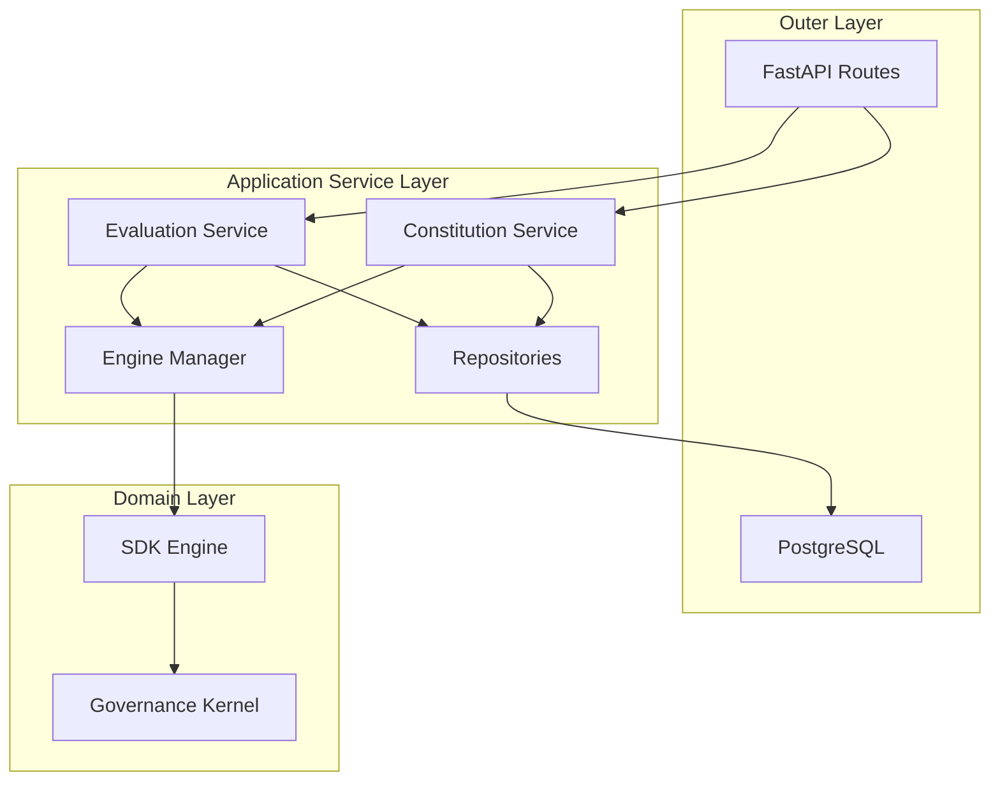

# Application Architecture

The Neural Constitution Engine embraces a strict layered architecture separating infrastructure from the core governance logic. The Engine kernel is infrastructure-independent and knows nothing about databases, API protocols, or multi-tenancy.

## Dependency Direction

Dependencies MUST point inwards toward the Governance Kernel. The kernel MUST NOT depend on outer layers.

## Service Layer

- **Constitution Service**: Manages publishing, versioning, and rolling back constitutions.
- **Evaluation Service**: Orchestrates decision requests, engine retrieval, execution, and audit persistence.
- **Engine Manager**: Caches and instantiates active SDK Engines for multi-tenancy.

## Repositories

Repositories are strictly for database interactions:
- `ConstitutionRepository`
- `AuditRepository`
- `OrganizationRepository`

## Lifecycles

### Engine Lifecycle
1. **Miss**: EngineManager queries ConstitutionRepository for active YAML.
2. **Build**: EngineManager uses ConstitutionLoader and instantiates Engine natively.
3. **Cache**: Engine is stored in in-memory cache mapped by `org_id:version`.
4. **Hit**: EngineManager retrieves Engine from cache.
5. **Invalidate**: EngineManager drops the cached instance when the constitution changes.

### Constitution Lifecycle
1. **Draft**: Modified in frontend Builder.
2. **Publish**: Pushed via Constitution Service. Stored in DB, set to Active.
3. **Invalidation**: EngineManager cache is cleared.
4. **Serve**: Next request builds and caches the new engine version.
