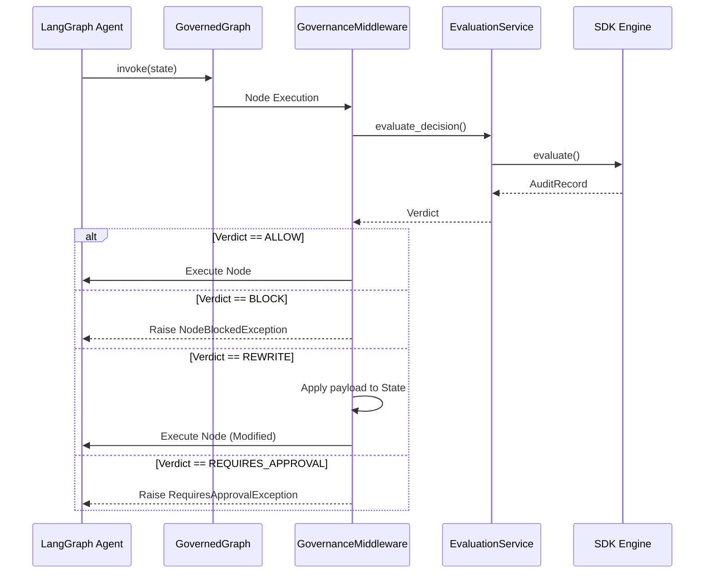

# LangGraph Integration

The Neural Constitution Engine (NCE) seamlessly integrates with LangGraph, allowing autonomous AI agents to be governed by programmable constitutions.

This integration uses a proxy-pattern via the `GovernedGraph` class to automatically intercept node executions without altering your existing LangGraph code.

## Architecture

The integration exists entirely as an adapter layer on top of the NCE Application Layer. LangGraph depends on NCE, but NCE remains entirely independent of LangGraph.



## Quick Start

Wrap your `StateGraph` with `GovernedGraph` before compiling it.

```python
from langgraph.graph import StateGraph
from backend.integrations.langgraph import GovernedGraph, GovernedGraphConfig

# 1. Define your graph
graph = StateGraph(AgentState)
graph.add_node("GenerateCode", generate_code)
# ... add edges ...

# 2. Configure Governance
config = GovernedGraphConfig(
    organization_id="org-123",
    strict_mode=True
)

# 3. Wrap Graph
safe_graph = GovernedGraph(graph, eval_service, config)

# 4. Compile and Run
app = safe_graph.compile()
state = await app.ainvoke({"input": "task"})
```

## Verdict Handling

- **ALLOW**: Node executes normally.
- **BLOCK**: Halts graph execution immediately, raising `NodeBlockedException`.
- **REWRITE**: The NCE-provided payload is merged into the Graph State *before* the node executes.
- **REQUIRES_APPROVAL**: Raises `RequiresApprovalException` (can be configured to use LangGraph Native Checkpointers in the future).
- **LOG_ONLY**: Node executes normally, but a governance audit is recorded silently.
