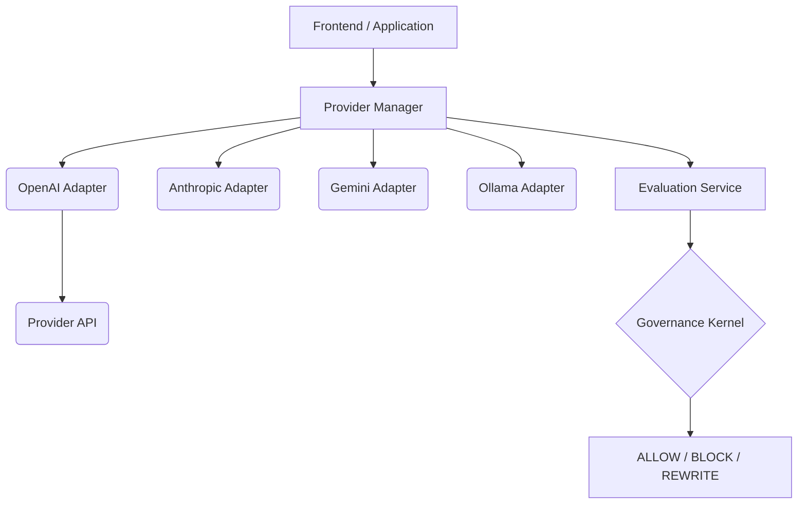

# AI Provider Integration

The Neural Constitution Engine (NCE) includes an application-layer Provider Integration that allows developers to swap between models seamlessly while strictly enforcing Governance Hooks on every generated execution plan or decision.

## Architecture

## Features
* **Abstract Interface**: All providers implement `BaseAIProvider`.
* **Zero Kernel Dependencies**: The Governance Kernel remains completely oblivious to HTTP, LLMs, and providers.
* **Telemetry & Cost Tracking**: Provider latency, token counts, and success rates are recorded.
* **Retries & Failovers**: Automatic retry logic on API errors.

## Supported Providers
- OpenAI (`openai`)
- Anthropic (`anthropic`)
- Google Gemini (`gemini`)
- Ollama (`ollama`)

## Governance Interception
The integration layer ensures that after a provider generates an action or plan, the application securely delegates it to the Governance Kernel via the `EvaluationService` before returning to the user or executing it in LangGraph.
