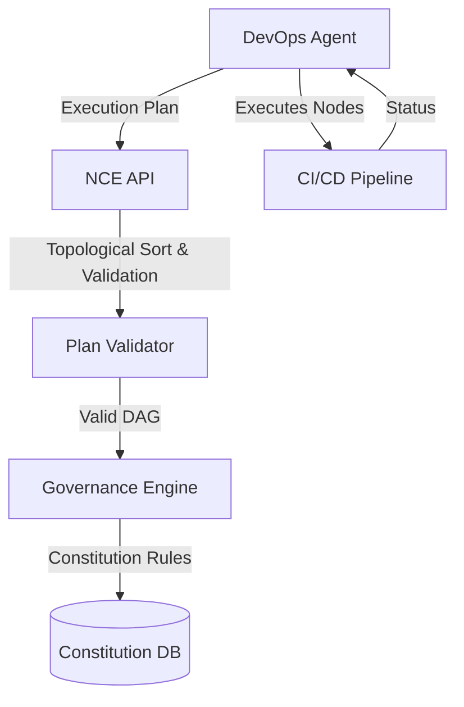
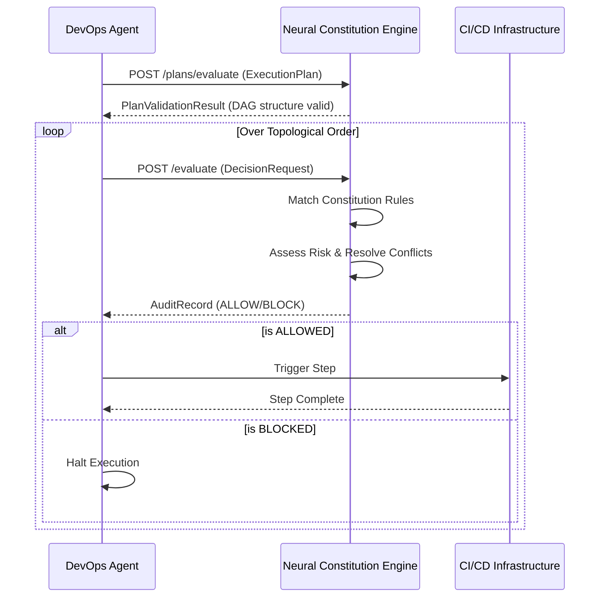

# NCE DevOps Integration Architecture

This document describes how the Neural Constitution Engine (NCE) integrates with a modern, autonomous DevOps Agent.

## High Level Architecture

## Sequence Diagram

## Explanation

1. **Autonomous Planning:** The agent synthesizes an `ExecutionPlan` which maps out dependencies (e.g., Build -> Unit Tests -> Deploy).
2. **Graph Validation:** NCE verifies that the plan is a valid Directed Acyclic Graph (DAG) and provides a safe execution order.
3. **Step-by-Step Governance:** Before taking any action on the CI/CD pipeline, the agent requests permission from the NCE.
4. **Enforcement:** If a critical rule (like requiring CAB approval for production) is violated, NCE issues a `BLOCK` verdict. The agent stops immediately, preventing risky deployments.
